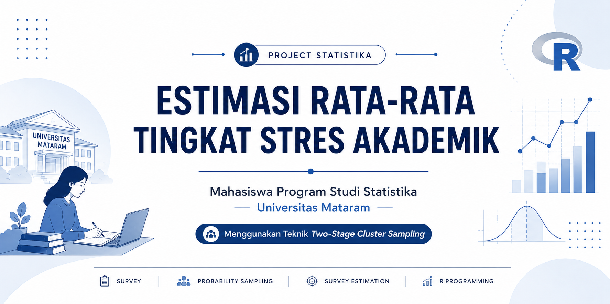

<p align="center">
  
</p>

<div align="center">

# Estimasi Rata-Rata Tingkat Stres Akademik Mahasiswa Program Studi Statistika Universitas Mataram Menggunakan Teknik Two-Stage Cluster Sampling


</div>

---

# Project Overview

Repository ini mendokumentasikan proses analisis survei mengenai **estimasi rata-rata tingkat stres akademik mahasiswa Program Studi Statistika Universitas Mataram** menggunakan pendekatan **Two-Stage Cluster Sampling**.

Analisis dilakukan menggunakan bahasa pemrograman **R**, mulai dari import data, data cleaning, skoring kuesioner, statistik deskriptif, deteksi outlier, pembobotan sampel, hingga estimasi rata-rata menggunakan desain survei berbobot. Selain itu, kualitas hasil estimasi dievaluasi melalui **Standard Error (SE)**, **Confidence Interval (CI)**, **Relative Standard Error (RSE)**, dan **Design Effect (DEFF)**.

Repository ini disusun sebagai dokumentasi project sehingga setiap tahapan analisis dapat dipelajari, direplikasi, dan dijadikan referensi dalam penerapan metode survei menggunakan **Two-Stage Cluster Sampling**.

<p align="right">
<a href="#table-of-contents">Back to Table of Contents</a>
</p>

---

# Repository Structure

```text
Estimasi-Tingkat-Stres-Akademik/
├── README.md
├── Executive_Summary.pdf
├── data/
│   └── Data_Responden.xlsx
├── script/
│   └── ANALISIS ESTIMASI RATA-RATA TINGKAT STRES AKADEMIK.R
├── randomisasi/
│   └── Hasil_Randomisasi.pdf
├── images/
│   ├── banner.png
│   ├── histogram.png
│   └── boxplot.png
└── questionnaire/
    └── Kuesioner.pdf
```

- **README.md** berisi dokumentasi lengkap project.
- **Executive_Summary.pdf** berisi ringkasan hasil penelitian.
- **data/** berisi dataset yang digunakan pada proses analisis.
- **script/** berisi seluruh syntax analisis menggunakan R.
- **randomisasi/** berisi hasil proses randomisasi cluster dan responden.
- **images/** berisi visualisasi yang digunakan pada README.
- **questionnaire/** berisi instrumen penelitian yang digunakan pada pengumpulan data.

---

<a id="table-of-contents"></a>

# Table of Contents

- [Research Background](#research-background)
- [Research Objectives](#research-objectives)
- [Research Methodology](#research-methodology)
- [Analysis Workflow](#analysis-workflow)
- [Dataset](#dataset)
- [Data Analysis](#data-analysis)
- [Results and Findings](#results-and-findings)
- [Conclusion](#conclusion)
- [References](#references)

---

<a id="research-background"></a>

# Research Background

Stres akademik merupakan salah satu tantangan yang umum dialami mahasiswa selama menjalani proses perkuliahan. Beban tugas, jadwal akademik yang padat, tuntutan memperoleh prestasi, serta kemampuan mengatur waktu menjadi beberapa faktor yang dapat memengaruhi tingkat stres akademik.

Untuk memperoleh gambaran tingkat stres akademik yang mewakili populasi mahasiswa, penelitian ini menggunakan pendekatan **Probability Sampling** melalui teknik **Two-Stage Cluster Sampling**. Teknik ini dipilih karena proses pemilihan sampel dilakukan secara bertahap, dimulai dari pemilihan cluster kemudian dilanjutkan dengan pemilihan responden pada cluster yang terpilih.

Selain menghasilkan estimasi rata-rata, penelitian ini juga memperhitungkan bobot sampel sehingga hasil estimasi yang diperoleh lebih representatif terhadap populasi sasaran.

<p align="right">
<a href="#table-of-contents">Back to Table of Contents</a>
</p>

---

<a id="research-objectives"></a>

# Research Objectives

Penelitian ini bertujuan untuk:

- Mengestimasi rata-rata tingkat stres akademik mahasiswa Program Studi Statistika Universitas Mataram.
- Menerapkan teknik **Two-Stage Cluster Sampling** dalam proses pengambilan sampel.
- Menghitung bobot sampel berdasarkan peluang pemilihan pada setiap tahap sampling.
- Mengestimasi rata-rata populasi menggunakan pendekatan **Survey Estimation**.
- Mengevaluasi kualitas hasil estimasi melalui Standard Error (SE), Confidence Interval (CI), Relative Standard Error (RSE), dan Design Effect (DEFF).

<p align="right">
<a href="#table-of-contents">Back to Table of Contents</a>
</p>

---

<a id="research-methodology"></a>

# Research Methodology

Penelitian ini merupakan penelitian survei kuantitatif yang bertujuan mengestimasi rata-rata tingkat stres akademik mahasiswa Program Studi Statistika Universitas Mataram.

Pengambilan sampel dilakukan menggunakan teknik **Two-Stage Cluster Sampling**. Pada tahap pertama dipilih dua cluster dari enam kelas yang terdapat pada populasi. Selanjutnya dilakukan pemilihan responden menggunakan **Simple Random Sampling (SRS)** pada masing-masing cluster terpilih sehingga diperoleh 30 responden.

Data dikumpulkan menggunakan kuesioner dengan **12 butir pernyataan** yang diukur menggunakan skala Likert **1–4**. Seluruh proses pengolahan data dilakukan menggunakan bahasa pemrograman **R** dengan package **readxl** dan **survey**.

<p align="right">
<a href="#table-of-contents">Back to Table of Contents</a>
</p>

---

<a id="analysis-workflow"></a>

# Analysis Workflow

Tahapan analisis pada project ini dilakukan secara berurutan sebagai berikut.

1. Import Data
2. Memeriksa Struktur Data
3. Membentuk Variabel Cluster
4. Data Cleaning
5. Skoring Kuesioner
6. Statistik Deskriptif
7. Deteksi Outlier
8. Pembobotan Sampel
9. Pembentukan Desain Survei
10. Estimasi Rata-Rata
11. Evaluasi Kualitas Estimasi

<p align="right">
<a href="#table-of-contents">Back to Table of Contents</a>
</p>
